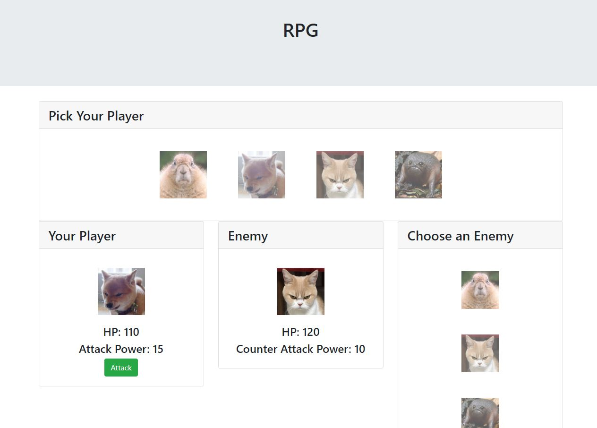

# RPG

## Summary
This is my RPG web application. The user is prompted to select a character to battle the other characters. The user must carefully select the opposing characters to win the game.

## Site Pictures


## Technologies Used 
- HTML - Used to create elements on the DOM
- JS - Used to manipulate content on HTML
- JQuery - JavaScript library used for DOM manipulation
- AJAX - Used to update webpage asynchronously through outside web server data exchange
- Github - Hosts repository that can be deployed to GitHub pages

## Code Snippet
The following code shows the on click function that occurs with the player clicks the attack button. 
```js
$("#button-attack").off("click")
$("#button-attack").on("click", function() {
    enemyHP = enemyHP - newPlayerAttack;
    $("#enemy-hp").html("HP: " + enemyHP);
    player1hp = player1hp - enemyCounter;
    $("#your-hp").html("HP: " + player1hp);
    newPlayerAttack = newPlayerAttack + player1attack;
    $("#attack-power").html("Attack Power: " + newPlayerAttack);
    
    if (player1hp <= 0) {
        player1hp = 0;
        $("#your-hp").html("HP: " + player1hp);
        alert("Game Over");
        reset();
    }
    }
            
```

## Author Links
https://github.com/hagoodj